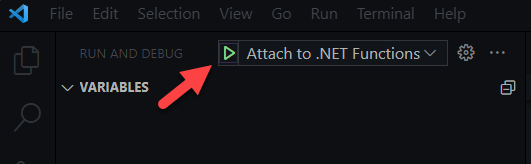

## Azure Functions Out-of-Process (Isolated)

This sample shows you how to use Azure Functions in an out-of-process (Isolated) environment and secure it with Azure AD. There is a custom middleware that performs the token validation

### Prerequisites
You need to download and install the following tools and runtimes. 

- Azure AD  - Free via the [M365 Developer Program](https://developer.microsoft.com/en-us/microsoft-365/dev-program)
- .NET 6.0  - [Download](https://dotnet.microsoft.com/download)
- Azure Function Core Tools - [Download](https://github.com/Azure/azure-functions-core-tools)

### Configure the Azure AD App Registrations

You can use the `Function API with test client.ipynb` notebook to create your Azure AD App Registrations.

### Running the Function (locally)

To run this sample, you will need to update the `appsettings.json` file with your own Azure AD Application details.

```JSON
{
    "AzureAd": {
        "Instance": "https://login.microsoftonline.com/",
        "Domain": "<your tenant name>.onmicrosoft.com",
        "TenantId": "<your tenant id>",
        "ClientId": "<your app registration app id"
  }
}
```

The sample already contains the .vscode folder with the necessary settings to run the Azure Function locally and help you debug any issues. Open the debugger and use the `Attach to .NET Functions` option to start debugging.




Alternatively, you can use the Azure Functions Core Tools to run the function locally with the following command:

```
func host start
```

### Calling the Azure Function API
You need a REST client to call the Azure Function API. The .NET Notebook is designed to create the client app registration for you but is optimized Thunder Client (a VS Code Rest Client). Alternatively, you can use something like Postman to authenticate and call the API

### Known Issues
Currently the isolated Azure Functions middleware doesn't expose the `HttpContext` object. This means that you can't the middleware to short circuit the request pipeline to send HTTP messages in response to a specific event, .e.g. a 401 Unauthorized response when there is an authentication error. The solution was to create an extension method for the `FunctionContext` object and use reflection to inject our response data into the context. The code was heavily ~~borrowed~~ inspired by the work of Joonas Westlin, an Azure MVP and Friend of Identity (Azure AD).

You can check out his solution [here](https://github.com/juunas11/IsolatedFunctionsAuthentication/blob/e083fd02a32305b7fbae56cd1a1236b50a320d33/IsolatedFunctionAuth/Middleware/FunctionContextExtensions.cs#L11-L31)
